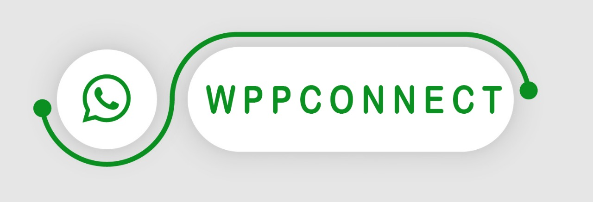

# WPPConnect 📞



[](https://www.npmjs.com/package/@wppconnect-team/wppconnect)
[](https://www.npmjs.com/package/@wppconnect-team/wppconnect)
[](https://isitmaintained.com/project/wppconnect-team/wppconnect 'Average time to resolve an issue')
[](https://isitmaintained.com/project/wppconnect-team/wppconnect 'Percentage of issues still open')
[](https://github.com/wppconnect-team/wppconnect/actions)
[](https://github.com/wppconnect-team/wppconnect/actions)
[](https://github.com/release-it/release-it)

> WPPConnect is an open source project developed by the JavaScript community with the aim of exporting functions from WhatsApp Web to the node, which can be used to support the creation of any interaction, such as customer service, media sending, intelligence recognition based on phrases artificial and many other things, use your imagination... 😀🤔💭

<p align="center">
  <a target="_blank" href="https://wppconnect.io/docs/tutorial/basics/installation">Getting Started</a> •
  <a target="_blank" href="https://wppconnect.io/docs/tutorial/basics/basic-functions">Basic Function</a> •
  <a target="_blank" href="https://wppconnect.io/wppconnect">Documentation</a>
</p>

## Our online channels

[](https://discord.gg/JU5JGGKGNG)
[](https://t.me/wppconnect)
[](https://chat.whatsapp.com/LJaQu6ZyNvnBPNAVRbX00K)
[](https://www.youtube.com/c/wppconnect)

## Functions

|                                                            |     |
| ---------------------------------------------------------- | --- |
| Automatic QR Refresh                                       | ✔   |
| Send **text, image, video, audio and docs**                | ✔   |
| Get **contacts, chats, groups, group members, Block List** | ✔   |
| Send contacts                                              | ✔   |
| Send stickers                                              | ✔   |
| Send stickers GIF                                          | ✔   |
| Multiple Sessions                                          | ✔   |
| Forward Messages                                           | ✔   |
| Receive message                                            | ✔   |
| insert user section                                        | ✔   |
| Send _location_                                            | ✔   |
| **and much more**                                          | ✔   |

See more at <a target="_blank" href="https://wppconnect.io/wppconnect/classes/Whatsapp.html">WhatsApp methods</a>

## Installation

The first thing that you had to do is install the `npm package` :

```bash
npm i --save @wppconnect-team/wppconnect
```

See more at <a target="_blank" href="https://wppconnect.io/docs/tutorial/basics/installation">Getting Started</a>

## Development

Building WPPConnect is really simple, to build the entire project just run

```bash
> npm run build
```

# Update checking

Whatsapp is in constant change. In order to tackle this issue, we suggest always keeping your Wppconnect package up-to-date.

The method/function names won't change, only their core algorithm. This way you won't have to makes changes in your code at every update.
They will remain the same forever but might experience deprecation.

## Maintainers

Maintainers are needed, I cannot keep with all the updates by myself. If you are
interested please open a Pull Request.

## Contributing

Pull requests are welcome. For major changes, please open an issue first to
discuss what you would like to change.

## Star History

[](https://star-history.com/#wppconnect-team/wppconnect&wppconnect-team/wa-js&Date)

## License

This file is part of WPPConnect.

WPPConnect is free software: you can redistribute it and/or modify
it under the terms of the GNU Lesser General Public License as published by
the Free Software Foundation, either version 3 of the License, or
(at your option) any later version.

WPPConnect is distributed in the hope that it will be useful,
but WITHOUT ANY WARRANTY; without even the implied warranty of
MERCHANTABILITY or FITNESS FOR A PARTICULAR PURPOSE. See the
GNU Lesser General Public License for more details.

You should have received a copy of the GNU Lesser General Public License
along with WPPConnect. If not, see <https://www.gnu.org/licenses/>.
# wppagent


API Testing Guide
Test 1: Health Check 🏥
Purpose: Verify server is running

bash
curl http://localhost:3000/health
✅ Expected Response:

json
{
  "status": "healthy",
  "timestamp": "2024-12-20T10:30:00.000Z",
  "uptime": 15.5,
  "environment": "development"
}
Test 2: User Registration 👤
Purpose: Create admin user account

bash
curl -X POST http://localhost:3000/api/v1/auth/register \
  -H "Content-Type: application/json" \
  -d '{
    "email": "admin@test.com",
    "password": "Admin123!",
    "name": "Admin User",
    "role": "admin"
  }'
✅ Expected Response:

json
{
  "success": true,
  "data": {
    "user": {
      "id": "c10660a8-3d99-4fb2-8fd3-8039b7819175",
      "email": "admin@test.com",
      "name": "Admin User",
      "role": "admin"
    },
    "token": "eyJhbGciOiJIUzI1NiIsInR5cCI6IkpXVCJ9..."
  },
  "message": "User registered successfully"
}
📝 Save Token:

bash
TOKEN="<paste-your-token-here>"
Test 3: User Login 🔐
bash
curl -X POST http://localhost:3000/api/v1/auth/login \
  -H "Content-Type: application/json" \
  -d '{
    "email": "admin@test.com",
    "password": "Admin123!"
  }'
Test 4: Get Current User 👨‍💼
bash
curl -X GET http://localhost:3000/api/v1/auth/me \
  -H "Authorization: Bearer $TOKEN"
✅ Expected Response:

json
{
  "success": true,
  "data": {
    "user": {
      "id": "c10660a8-3d99-4fb2-8fd3-8039b7819175",
      "email": "admin@test.com",
      "name": "Admin User",
      "role": "admin"
    }
  }
}
Test 5: Create Session 📱
bash
curl -X POST http://localhost:3000/api/v1/sessions \
  -H "Authorization: Bearer $TOKEN" \
  -H "Content-Type: application/json" \
  -d '{
    "sessionName": "test-session",
    "autoReconnect": true
  }'
✅ Expected Response:

json
{
  "success": true,
  "data": {
    "id": 1,
    "session_name": "test-session",
    "status": "disconnected",
    "auto_reconnect": true
  },
  "message": "Session created successfully"
}
Test 6: Start Session 🚀
bash
curl -X POST http://localhost:3000/api/v1/sessions/test-session/start \
  -H "Authorization: Bearer $TOKEN"
✅ Expected Response:

json
{
  "success": true,
  "data": null,
  "message": "Session started successfully"
}
⏱️ Wait 5-10 seconds

Test 7: Get QR Code 📷
bash
curl -X GET http://localhost:3000/api/v1/sessions/test-session/qr \
  -H "Authorization: Bearer $TOKEN"
✅ Expected Response:

json
{
  "success": true,
  "data": {
    "qr_code": "data:image/png;base64,iVBORw0KGgoAAAANSUhEUgAAA..."
  }
}
View QR Code:

Copy base64 string

Open browser console (F12)

Paste:

javascript
let img = document.createElement('img');
img.src = 'data:image/png;base64,<paste-here>';
img.style.width = '300px';
document.body.appendChild(img);
Test 8: List Sessions 📋
bash
curl -X GET http://localhost:3000/api/v1/sessions \
  -H "Authorization: Bearer $TOKEN"
Test 9: Get Session Details 🔍
bash
curl -X GET http://localhost:3000/api/v1/sessions/test-session \
  -H "Authorization: Bearer $TOKEN"
Test 10: Get Session Stats 📊
bash
curl -X GET http://localhost:3000/api/v1/sessions/test-session/stats \
  -H "Authorization: Bearer $TOKEN"
✅ Expected Response:

json
{
  "success": true,
  "data": {
    "messages_sent": 5,
    "messages_received": 12,
    "total_contacts": 8,
    "total_conversations": 8,
    "open_conversations": 3
  }
}
Test 11: Send Message 💬
Prerequisites: Session must be connected (scan QR first)

bash
curl -X POST http://localhost:3000/api/v1/sessions/test-session/messages \
  -H "Authorization: Bearer $TOKEN" \
  -H "Content-Type: application/json" \
  -d '{
    "to": "5511999999999@c.us",
    "message": "Hello from WPPConnect Agent! 🚀"
  }'
Phone Number Format:

Format: [CountryCode][Number]@c.us

Brazil: 5511999999999@c.us

USA: 14155552671@c.us

Egypt: 201234567890@c.us

Test 12: Get Messages 📬
bash
curl -X GET "http://localhost:3000/api/v1/sessions/test-session/messages?page=1&limit=10" \
  -H "Authorization: Bearer $TOKEN"
Test 13: Search Messages 🔎
bash
curl -X GET "http://localhost:3000/api/v1/sessions/test-session/messages/search?q=hello&page=1&limit=10" \
  -H "Authorization: Bearer $TOKEN"
Test 14: Get Unread Count 📩
bash
curl -X GET http://localhost:3000/api/v1/sessions/test-session/messages/unread \
  -H "Authorization: Bearer $TOKEN"
Test 15: Stop Session 🛑
bash
curl -X POST http://localhost:3000/api/v1/sessions/test-session/stop \
  -H "Authorization: Bearer $TOKEN"
Test 16: Delete Session 🗑️
bash
curl -X DELETE http://localhost:3000/api/v1/sessions/test-session \
  -H "Authorization: Bearer $TOKEN"
